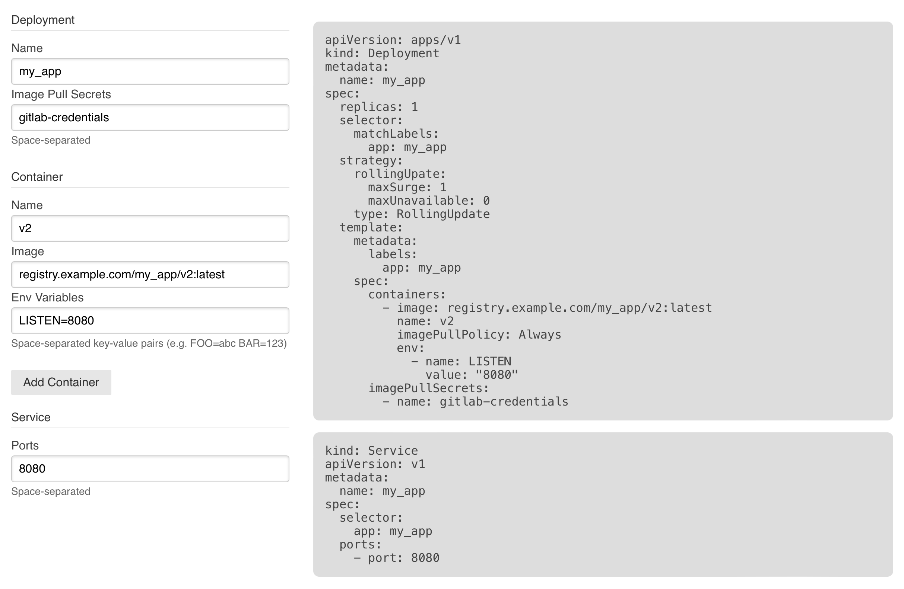

# K8S YAML Generator

`k8s-yaml-generator` is a simple tool to generate YAML files to aid in creating k8s deployments and services.



## CLI Commands

``` bash
# install dependencies
yarn

# serve with hot reload at localhost:8080
yarn run dev

# build for production with minification
yarn run build

# test the production build locally
yarn run serve

# run tests with jest and enzyme
yarn run test
```

For detailed explanation on how things work, checkout the [CLI Readme](https://github.com/developit/preact-cli/blob/master/README.md).

## Docker

``` bash
# Some docker for you
docker-compose up -d
```